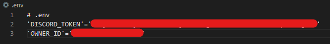

# Discord Music and Chat Bot
Needs a .env file with discord bot token and owner id

## Music Support with playlists
Still need to cleanup code though
## Responds to certain messages
If a message contains keyword 'Rem' at its start or its end, the message content will be compared to the existing possible messages in ./chat/Messages.txt. If a match is found, the line with the same index/linenumber of that message will be sent back from ./chat/Responses.txt
## Scrapes memes from reddit
!reddit dankmeme/animeme/memrimeme